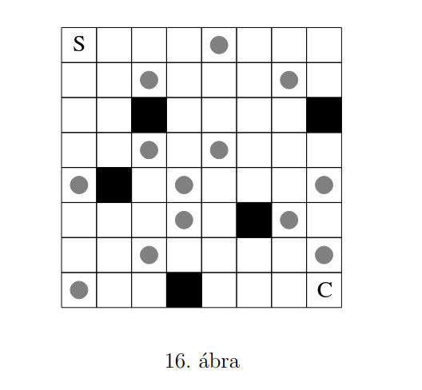

# Lépkedő (egyszemélyes logikai játék) - 1.18

A 16. ábrán adott tábla bal felső sarkából (S jelű mező) kell eljuttatni egy figurát a jobb alsó sarokba (C jelű mező).
A figurával az alábbi szabályoknak megfelelően kell lépni:
- A figura függőleges és vízszintes irányban mozoghat a táblán.
- Minden lépésben kötelezően 2 vagy 3 mezővel kell elmozdítani a figurát.
- A bal felső sarokból indulva kezdetben 2 mezőnyit kell elmozdulni a táblán.
- A figura mozgatása során meglépendő mezők száma 2-ről 3-ra, illetve 3-ról 2-re változik, ha a figura a körrel megjelölt mezőre kerül.
- A figurával nem lehet a sötét megőkre lépni.

Megoldás:

1. DOWN
2. DOWN
3. RIGHT
4. RIGHT
5. RIGHT
6. DOWN

A játék leírás esetén a javafx grafikus felületen egy S jelű mezőn egy szürke kör, a C jelű mezőn egy kék kör található.
A játék felhasználja a homework-project-utils könyvtár puzzle.State interfészét.
A megoldás megkereséséhez a homework-project-utils könyvtár puzzle.solver.BreadFirstSearch osztálya kerül felhasználásra.